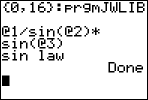

# JWLIB

By far my best work yet. A program that can be used by any other program to do difficult-to-code operations

## Usage:

Set the `Ans` variable to a list of numbers.  
The first number is the command number of the operator/function to run, the rest are arguments.  
For example, `{16,2,90°,45°}:prgmJWLIB` does the sine law, which in this case is `2/sin(90°)*sin(45°)`. The result of the function is available in the `Ans` variable  

Using the command variable `0` displays help information  
  
Of note is the variable naming scheme. Instead of `A`, `B`, `C`, and so on as I used to use, this uses an `@` followed by the argument number.

One final important note before the chart: The command `-16` is the inverse sine law, as in it returns `B`, given `A`, `a`, and `b`. Generally, the command `-c` undoes the command `c`, or is generally the opposite.

## The chart of commands

Command|Name|Info|Inv. Name|Inv. Info
:-|:-|:-|:-|:-
`0`|Help|`@1` is the command to display the help message for|N/A|N/A
1|Eqaul|`@1=@2`, but doesn't crash if one is complex and the other isn't|Not equal|`@1≠@2`|
2|Greater than|`@1>@2` (Returns 0 if either has a nonzero imaginary part. `2>1+0i` is 1, but `2>1+1i` is 0)|Less than or equal to|`@1≤@2`
3|Less than|`@1<@2`|Greater than or equal to|`@1≥@2`
4|Approximately|`abs(@1-@2)≤abs(@3)`|Sign|`0 if @1=0 else abs(@1)/@1`
10|Sine|`sin(@1) or sin(@1+@2*i)`|Inv. Sine|`arcsin(@1) or arcsin(@1+@1*i)`
11|Cosine|`cos(@1) or cos(@1+@2*i)`|Inv. Cosine|`arccos(@1) or arccos(@1+@1*i)`
12|Tangent|`tan(@1) or tan(@1+@2*i)`|Inv. Tangent|`arctan(@1) or arctan(@1+@1*i)`
13|Hyp. Sine|`sinh(@1) or sinh(@1+@2*i)`|Inv. Hyp. Sin|`arcsinh(@1) or arcsinh(@1+@1*i)`
14|Hyp. Cosine|`cosh(@1) or cosh(@1+@2*i)`|Inv. Hyp. Cosine|`arccosh(@1) or arccosh(@1+@1*i)`
15|Hyp. Tangent|`tanh(@1) or tanh(@1+@2*i)`|Inv. Hyp. Tangent|`arctanh(@1) or arctanh(@1+@1*i)`
16|Sine law|`@1/sin(@2)*sin(@3)`|Inv. Sine law|`sin(@1)/@2*@3`
17|Cosine law|`sqrt(@1^2+@2^2-2@1@2cos(@3))`|Inv. Cosine law|`arccos((@3^2-@2^2-@1^2)/(-2@1@2))`
20|Convert linear equations|Type 1 is ax+by+c=0, Type 2 is y=mx+b. If `@1` is 1, convert `@3`, `@4`, and `@5` to the type of `@2`. if `@1` is 2, convert `@3` and `@4` to the type of `@2`|N/A|N/A
21|Solve linear system|If `@1` is 1, `@3`, `@4`, `@5` define equation 1, and you can probably guess the rest. (returns the point of intersection as `{X,Y}`)|N/A|N/A
22|Convert quadratic equations|Type 1 is `@1X^2+@2X+@3`, type 2 is `@1(X-@2)^2+@3`, and type 3 is `@1(X-@2)(X-@3)`. Yadda yadda, you know how this works|N/A|N/A
23|Get the roots of a quadratic function|Literally just `{22,@1,2,@2,@3,@4}:prgmJWLIB:{Ans(2),Ans(3)}`|N/A|N/a
24|Get the vertex of a quadratic function|`{22,@1,2,@2,@3,@4}:prgmJWLIB:{Ans(2),Ans(3)}`|N/A|N/A

## Special notes

- JWLIB uses the list variables `JW` and `JWP`. If your program already uses these variables, then I don't know what to tell you.

- Although JWLIB properly handles both degree and radian mode, built-in functions such as `sinh(` don't, and are always in radian mode. Due to this, the list `JW` is not necesarily the exact arguments passed into the program.  
As an example, `{10,30°}` sets list `JW` to `{10,30°,0°,rad(30°), rad(0°)}` (Elements 3 and 4 are properly converted to radians.)

- It is highly recommended to have your calculator in `a+bi` mode when using JWLIB, the other modes are as-of-yet untested, and may break things (`re+θi` should be fine)

- ~~Parts of this program use the tokens `0x5C0A` through `0x5C1F`. These can all be used as matrices and are used to prevent collisions between programs. *If you see a matrix being assigned to a non-matrix variable, do not fix it as that will break it.*~~ (Not yet applicable)

## TODO:

- Add a command that converts a list of points into the polynomial they define (Ideally using Vandermonde matrices, but complex elements aren't supported)

- Synthetic division?

- Prime/coprime checker

