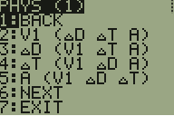
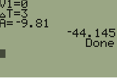

## TIBASIC-formulas : PHYS.8xp

Calculator for velocities, acceleration, etc..

### Variables
- **Speed** (P1-P6)
 - V1 (V)=Start velocity
 - V2 (V[1])=End velocity
 - &Delta;T (T)=Change in time
 - &Delta;D (D)=Change in distance/height above ground
 - A (A)=Acceleration
- **Friction of moving objects** (P7)
 - &Delta;S (S)=Change in speed (not velocity)
 - &mu;K (K)=Coefficent of friction for a moving object
 - G (G)=Gravity (-9.81)
- **Friction of static objects** (P8)
 - M (M)=Mass of object
 - F (F)=Applied force
 - &mu;S (S)=Coefficent of friction for a static object

### Formulas

- **Page 1** (V1 &Delta;D &Delta;T A)
 - V1 given &Delta;D, &Delta;T, and A
 - &Delta;D given V1, &Delta;T, and A
 - &Delta;T given V1, &Delta;D, and A
 - A given V1, &Delta;D, and &Delta;T
- **Page 2** (V2 &Delta;D &Delta;T A)
 - V2 given &Delta;D, &Delta;T, and A
 - &Delta;D given V2, &Delta;T, and A
 - &Delta;T given V2, &Delta;D, and A
 - A given V2, &Delta;D, and &Delta;T
- **Page 3** (V2 &Delta;D &Delta;T A => V1)
 - V1 given &Delta;D, &Delta;T, and A
 - V1 given V2, &Delta;D, and A
 - V1 given V2, &Delta;T, and A
 - V1 given V2, &Delta;D, and &Delta;T
- **Page 4** (V2 &Delta;D &Delta;T A => V1)
 - V2 given &Delta;D, &Delta;T, and A
 - V2 given V1, &Delta;D, and A
 - V2 given V1, &Delta;T, and A
 - V2 given V1, &Delta;D, and &Delta;T
- **Page 5** ([V1 V2] &Delta;D &Delta;T A)
 - &Delta;D given V1 V2 &Delta;T
 - &Delta;T given V1 V2 &Delta;D
 - A given V1 V2 &Delta;D
- **Page 6** ([V1 V2] &Delta;D &Delta;T A)
 - &Delta;D given V1 V2 A
 - &Delta;T given V1 V2 A
 - A given V1 V2 &Delta;T
- **Page 7** (&Delta;S &mu;K G)
 - &Delta;S given &mu;K and G
 - &mu;K given &Delta;S and G
 - G given &Delta;S and &mu;K
 - &Delta;S given &mu;K, M, F, and G
- **Page 8** (M F &mu;S G)
 - M given F, &mu;S, and G
 - F given M, &mu;S, and G
 - &mu;S given M, F, and G
 - G given M, F, &mu;S

## Screenshots

Page 1  

Dropping an object and finding its displacement after 3 seconds  

***

**Footnotes**

[1]: When both V1 and V2 are used, V2 is set to W
